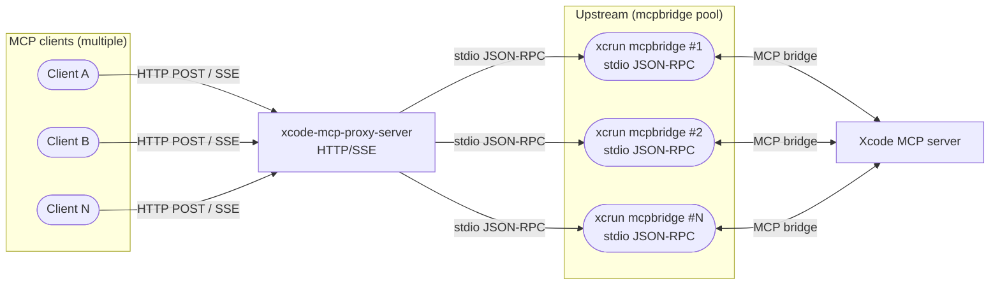
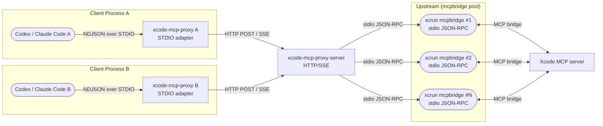

# XcodeMCPProxy Architecture

## Summary
- `xcode-mcp-proxy-server` runs as the proxy server (HTTP/SSE; spawns `xcrun mcpbridge`).
- HTTP-capable MCP clients connect directly to the proxy server (default: `http://localhost:8765/mcp`).
- `xcode-mcp-proxy` runs as a STDIO adapter for clients that require STDIO, forwarding to the proxy server over HTTP/SSE.

## Diagrams

### Proxy Server (HTTP/SSE)

### STDIO Adapter (Optional)

## Ports and Addressing
- `xcode-mcp-proxy-server` binds to `localhost:8765` by default (override via `--listen` / `--host` / `--port`, or env `LISTEN` / `HOST` / `PORT`).
- The proxy server writes the resolved endpoint to `~/Library/Caches/XcodeMCPProxy/endpoint.json`.
- `xcode-mcp-proxy` (STDIO adapter) resolves the upstream in this order:
  - `XCODE_MCP_PROXY_ENDPOINT`
  - discovery file (`~/Library/Caches/XcodeMCPProxy/endpoint.json`)
- default (`http://localhost:8765/mcp`)
