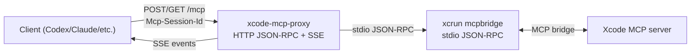

# XcodeMCPProxy Architecture

## Summary
- `xcode-mcp-proxy` is a single HTTP server process that exposes MCP over JSON-RPC + SSE.
- The proxy spawns `xcrun mcpbridge` as an upstream process and relays MCP messages over stdio.
- `mcpbridge` connects to the Xcode MCP server and provides tool access.

## Processes
- **Client**: Codex / Claude Code / other MCP clients. Connects to `http://localhost:8765/mcp`.
- **Proxy**: `xcode-mcp-proxy` (SwiftNIO HTTP server). Manages sessions and SSE fan-out.
- **Upstream**: `xcrun mcpbridge` (stdio JSON-RPC).
- **Xcode**: Xcode MCP server and tool implementations.

## Data Flow (High Level)
1. Client sends JSON-RPC requests to `POST /mcp` (optionally with `Mcp-Session-Id`).
2. The proxy creates or reuses a session, maps request IDs, and forwards JSON to `mcpbridge`.
3. `mcpbridge` responds on stdout; the proxy routes responses back to the correct session.
4. Notifications are streamed to clients via `GET /mcp` (SSE).

## Initialization Behavior
- The upstream process is started when the proxy boots.
- With `--lazy-init`, the proxy defers sending the `initialize` request until the first client request.
- If the upstream process exits, the proxy restarts it with exponential backoff.

## Ports and Addressing
- Default listen address: `localhost:8765`.
- Override with `--listen host:port` or `--host` / `--port`.

## Process Diagram

