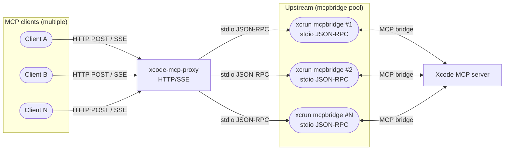
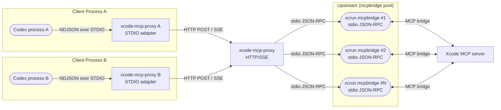

# XcodeMCPProxy Architecture

## Summary
- `xcode-mcp-proxy` runs as a single HTTP/SSE proxy.
- MCP clients connect over HTTP to `/mcp` (no STDIO adapter).
- The proxy spawns one or more `xcrun mcpbridge` processes, which bridge to the Xcode MCP server.

## Diagrams

### HTTP/SSE (Main)

### STDIO Adapter (Optional)

## Processes (HTTP/SSE)
- **Client**: MCP client (Codex / Claude Code / etc.).
- **Proxy**: `xcode-mcp-proxy` (central proxy).
- **Upstream**: `xcrun mcpbridge` (stdio JSON-RPC; one or more processes).
- **Xcode**: Xcode MCP server and tool implementations.

## Optional: STDIO Adapter Mode
- Use this when a client **requires STDIO**.
- Each client runs a **STDIO adapter** (`xcode-mcp-proxy --stdio ...`).
- The adapter forwards NDJSON to the central proxy over HTTP/SSE.
- **A/B** in the diagram just means **multiple clients/adapters** (one per STDIO stream).

## Data Flow (HTTP/SSE)
1. Start the central HTTP proxy, which launches one or more `mcpbridge` processes.
2. The client connects to `/mcp` over HTTP.
3. The proxy forwards requests to the `mcpbridge` pool over stdio JSON-RPC.
4. Responses and notifications return over HTTP/SSE.

## Data Flow (STDIO Adapter)
1. Start the central HTTP proxy, which launches one or more `mcpbridge` processes.
2. Each client starts a STDIO adapter.
3. The adapter forwards NDJSON to the proxy via HTTP POST.
4. Notifications flow back over SSE and are emitted on STDIO (one stream per client).

## Initialization Behavior
- The central proxy starts one or more `mcpbridge` processes at launch.
- With `--lazy-init`, it delays `initialize` until the first request.
- If a `mcpbridge` process exits, it restarts with exponential backoff.

## Ports and Addressing
- Only the central proxy uses `--listen` / `--host` / `--port`.
- STDIO adapters do not use ports.
- The server binds to `localhost:0` by default and writes the resolved endpoint to
  `~/Library/Caches/XcodeMCPProxy/endpoint.json`.
- HTTP/SSE clients should read `url` from the discovery file to locate the active proxy endpoint.
- STDIO adapters resolve the upstream via `XCODE_MCP_PROXY_ENDPOINT` or the discovery file,
  with `http://localhost:8765/mcp` as a fallback.
