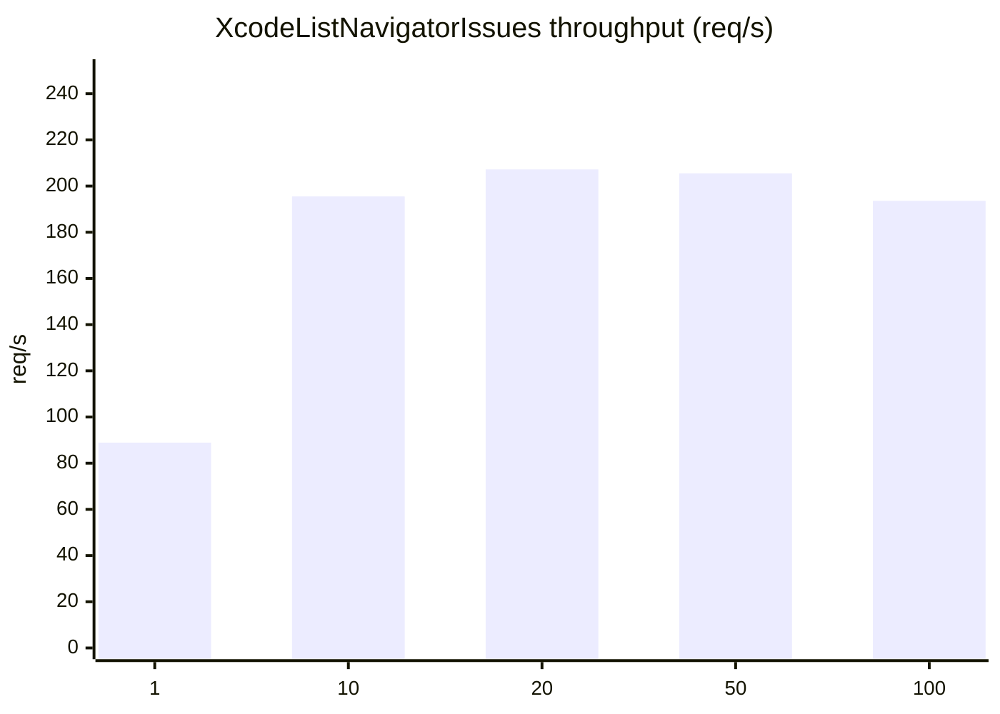
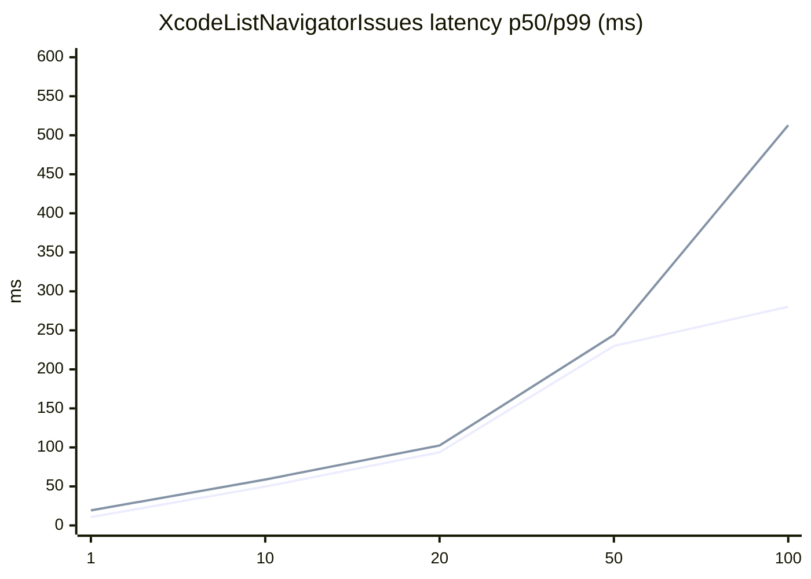
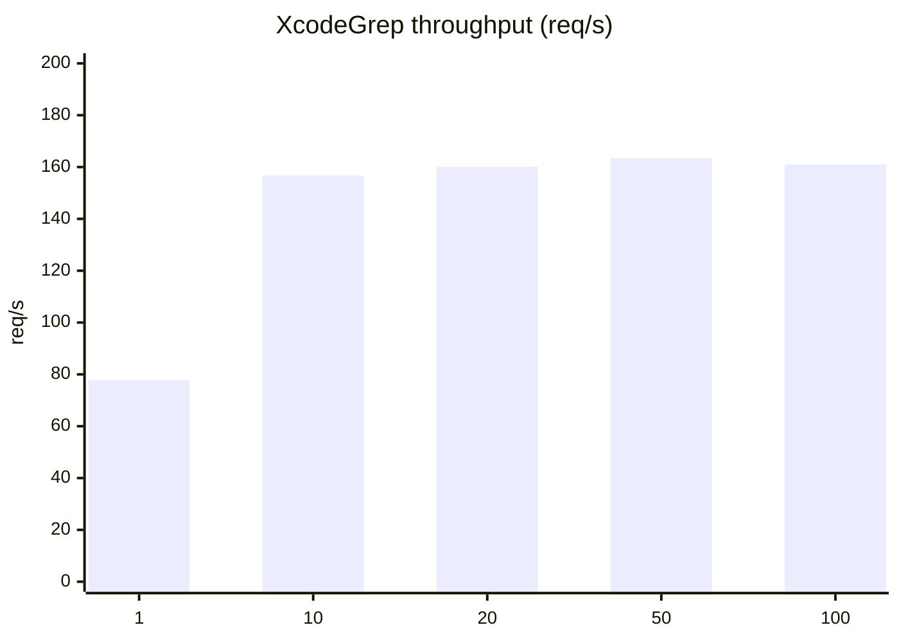
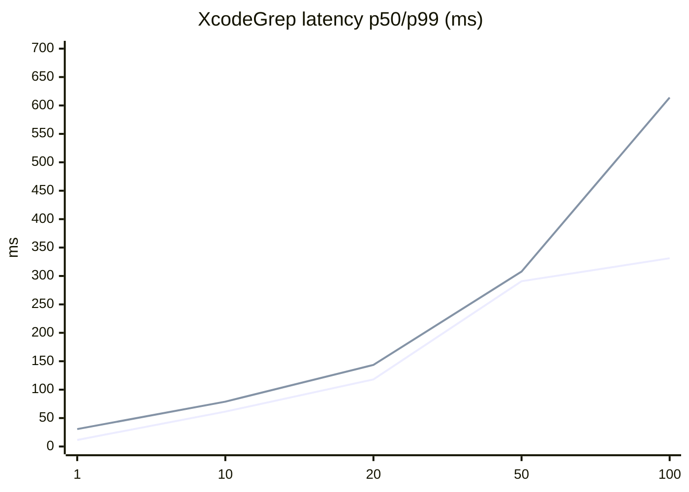
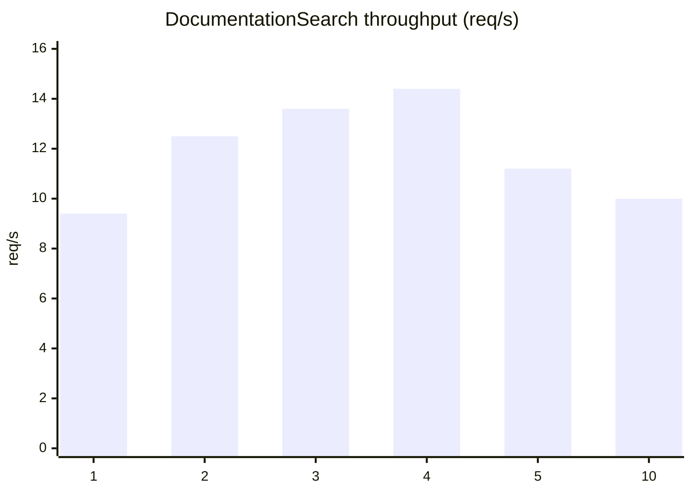
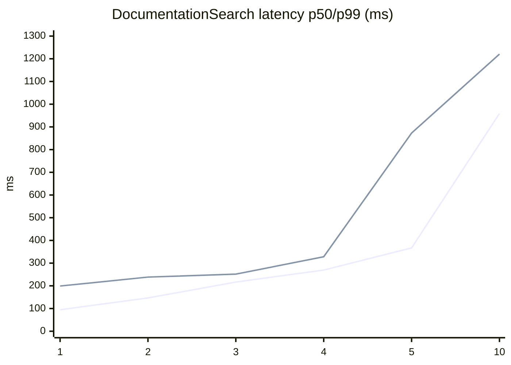

# MCP / Xcode MCP Benchmark Notes (Xcode 26.3)

## TL;DR
- `XcodeListNavigatorIssues` / `XcodeGrep`: raising parallelism (in-flight) increases throughput, but past a point latency spikes and throughput plateaus or degrades.
- `DocumentationSearch`: tends to be heavy and does not scale well; higher parallelism increases latency and may introduce timeouts, so keep it low (1 to 3) in production.

## Environment
- Date: `2026-02-06T05:06:24+09:00`
- macOS: `26.2 (25C56)`
- Xcode: `26.3 (17C519)`
- CPU: `Apple M1 Pro` (`hw.ncpu=10`)
- RAM: `32 GiB` (`hw.memsize=34359738368`)
- Target endpoint: `http://localhost:8765/mcp`

## Method
- Benchmark tool: `Tools/mcp_bench.swift`
- 1 request = 1 MCP JSON-RPC call (`tools/list` or `tools/call`)
- `--concurrency` = number of in-flight HTTP `POST /mcp` requests
- `--warmup` requests are not measured
- `--timeout` is the client-side per-request timeout (timeouts are counted as `err`)
- `initialize` is performed before the benchmark run (session setup)

## How To Run
```bash
swiftc -O Tools/mcp_bench.swift -o /tmp/mcp_bench

# tools/list (tool list)
/tmp/mcp_bench --print-tools

# tools/call
/tmp/mcp_bench --mode call --tool XcodeListWindows --requests 200 --concurrency 20 --warmup 20 --timeout 10
```

Notes:
- For tools that require `tabIdentifier`, obtain it first via `XcodeListWindows`.
- If the Xcode permission dialog has not been approved, `initialize` / `tools/call` may time out. Approving once before benchmarking makes results more stable.

## Inputs Used

### XcodeListNavigatorIssues
```json
{
  "tabIdentifier": "windowtab11",
  "severity": "warning"
}
```

### XcodeGrep
```json
{
  "tabIdentifier": "windowtab11",
  "pattern": "mcpbridge",
  "type": "swift",
  "outputMode": "count",
  "headLimit": 50
}
```

### DocumentationSearch
```json
{
  "query": "URLSession data task"
}
```

## Results
Legend:
- latency is reported by `mcp_bench` (ms)
- throughput is `requests / wall` (req/s)

Important: numbers can vary significantly depending on Xcode state (indexing/build activity, issue count, etc.). Treat these as snapshots and re-run with production-like load.

### XcodeListNavigatorIssues (`timeout=30s`, `warmup=10`)
| concurrency | requests | ok | err | throughput (req/s) | p50 (ms) | p90 (ms) | p99 (ms) | avg (ms) |
|---:|---:|---:|---:|---:|---:|---:|---:|---:|
| 1 | 100 | 100 | 0 | 88.9 | 10.7 | 14.4 | 19.3 | 11.2 |
| 10 | 100 | 100 | 0 | 195.5 | 49.8 | 54.9 | 58.8 | 48.9 |
| 20 | 100 | 100 | 0 | 207.2 | 93.7 | 99.1 | 102.4 | 87.3 |
| 50 | 100 | 100 | 0 | 205.5 | 230.0 | 236.5 | 244.1 | 180.8 |
| 100 | 100 | 100 | 0 | 193.6 | 280.3 | 463.6 | 512.9 | 267.9 |

#### Graphs (Mermaid)
Note: `xychart-beta` is not supported by all Mermaid renderers. If it does not render, refer to the table above.





Observations:
- Throughput peaked around `concurrency=20..50` in this run.
- Higher concurrency increases latency; at `concurrency=100`, tail latency (p99) grows noticeably.

### XcodeGrep (`timeout=30s`, `warmup=10`)
| concurrency | requests | ok | err | throughput (req/s) | p50 (ms) | p90 (ms) | p99 (ms) | avg (ms) |
|---:|---:|---:|---:|---:|---:|---:|---:|---:|
| 1 | 100 | 100 | 0 | 77.7 | 11.5 | 17.0 | 30.6 | 12.8 |
| 10 | 100 | 100 | 0 | 156.7 | 61.4 | 73.5 | 78.9 | 61.3 |
| 20 | 100 | 100 | 0 | 160.1 | 118.0 | 137.7 | 143.5 | 112.8 |
| 50 | 100 | 100 | 0 | 163.4 | 290.8 | 299.2 | 307.8 | 231.3 |
| 100 | 100 | 100 | 0 | 161.0 | 331.2 | 560.7 | 613.9 | 323.9 |

#### Graphs (Mermaid)
Note: `xychart-beta` is not supported by all Mermaid renderers. If it does not render, refer to the table above.





Observations:
- Throughput is relatively flat once `concurrency` is in the `10..100` range for this query.
- Higher concurrency increases latency and tail latency; `concurrency=50..100` trades p99 for marginal throughput change.
- Load varies a lot depending on `pattern` and `type`/`glob`. Re-benchmark with production-like queries to be safe.

### DocumentationSearch (`timeout=60s`)
| concurrency | requests | ok | err | throughput (req/s) | p50 (ms) | p90 (ms) | p99 (ms) | avg (ms) | note |
|---:|---:|---:|---:|---:|---:|---:|---:|---:|---|
| 1 | 20 | 20 | 0 | 9.4 | 94.5 | 158.0 | 199.1 | 106.0 | |
| 2 | 20 | 20 | 0 | 12.5 | 146.6 | 182.1 | 238.5 | 157.0 | |
| 3 | 30 | 30 | 0 | 13.6 | 216.6 | 235.0 | 251.5 | 213.4 | |
| 4 | 40 | 40 | 0 | 14.4 | 269.5 | 294.3 | 328.0 | 267.3 | |
| 5 | 30 | 30 | 0 | 11.2 | 366.9 | 649.3 | 872.7 | 424.4 | latency worsened significantly |
| 5 | 50 | 46 | 4 | 0.8 | 395.9 | 505.4 | 680.2 | 415.6 | timeouts mixed in (`transport error: timeout`) |
| 10 | 20 | 20 | 0 | 10.0 | 959.0 | 1215.9 | 1220.7 | 825.1 | latency worsened significantly |

#### Graphs (Mermaid)
Note: `xychart-beta` is not supported by all Mermaid renderers. If it does not render, refer to the table above.

These plots exclude the timeout-mixed row at `concurrency=5` (`requests=50`). Only stable, fully-completed rows (plus `concurrency=10`) are included.





Observations:
- At low parallelism throughput improves slightly, but higher parallelism causes **rapid latency growth**.
- Depending on conditions, timeouts may appear and wall time can be dragged close to 60 seconds.

## Sessions (Approximation of `mcpbridge` Multiplexing)
`mcp_bench --sessions` creates **multiple MCP sessions** (runs `initialize` multiple times and distributes requests across different `Mcp-Session-Id` values).

In production, running multiple `mcpbridge` processes effectively results in multiple sessions, so `--sessions` is a reasonable approximation.

Notes:
- This can help in some cases, but it is not a universal win (at high load it can also get worse).
- Numbers vary depending on machine, Xcode state (indexing/windows/load), etc. Use this section for trend validation, not as an absolute guarantee.

### XcodeListNavigatorIssues (`concurrency=20`, `requests=100`)
| sessions | ok | err | throughput (req/s) | p50 (ms) | p90 (ms) | p99 (ms) | avg (ms) |
|---:|---:|---:|---:|---:|---:|---:|---:|
| 1 | 100 | 0 | 203.3 | 96.1 | 100.7 | 105.8 | 89.5 |
| 2 | 100 | 0 | 196.8 | 96.3 | 100.2 | 118.8 | 92.5 |
| 5 | 100 | 0 | 193.3 | 92.7 | 129.9 | 136.2 | 91.2 |
| 10 | 100 | 0 | 204.4 | 95.8 | 100.4 | 102.6 | 89.0 |

Observations:
- No clear win from more sessions in this run; variance exists. Prioritize per-tool in-flight caps first.

### XcodeGrep (`concurrency=20`, `requests=100`)
| sessions | ok | err | throughput (req/s) | p50 (ms) | p90 (ms) | p99 (ms) | avg (ms) |
|---:|---:|---:|---:|---:|---:|---:|---:|
| 1 | 100 | 0 | 153.1 | 122.6 | 147.2 | 157.1 | 119.6 |
| 2 | 100 | 0 | 162.3 | 121.0 | 124.7 | 130.4 | 111.7 |
| 5 | 100 | 0 | 167.1 | 116.9 | 124.4 | 131.8 | 108.5 |
| 10 | 100 | 0 | 169.7 | 116.3 | 119.3 | 123.1 | 106.9 |

Observations:
- Session count can change results, but the effect is not consistent. Measure on your machine before relying on it.

### DocumentationSearch (`concurrency=3`, `requests=30`)
| sessions | ok | err | throughput (req/s) | p50 (ms) | p90 (ms) | p99 (ms) | avg (ms) | note |
|---:|---:|---:|---:|---:|---:|---:|---:|---|
| 1 | 30 | 0 | 11.6 | 217.3 | 351.0 | 425.4 | 250.2 | |
| 5 | 28 | 2 | 0.5 | 210.4 | 220.8 | 241.7 | 168.8 | timeouts mixed in (`transport error: timeout`) |

Observations:
- `sessions=5` produced timeouts in this run; avoid high session counts for `DocumentationSearch` unless you have measured it.

## Practical Guidance (Tentative)
- `XcodeListNavigatorIssues`: start with `concurrency=10..20`; raise only if you can tolerate higher tail latency.
- `XcodeGrep`: start with `concurrency=10..20`; `50..100` tends to trade p99 for small throughput changes (tool/query dependent).
- `DocumentationSearch`: keep `concurrency=1..3` and prefer `sessions=1`; if needed, raise timeout and put it behind a dedicated low-parallelism queue on the client side.
- `mcpbridge` multiplexing (validated via `--sessions` approximation): do not assume multi-process helps. Cap in-flight first, then measure session/process count as a secondary lever.
