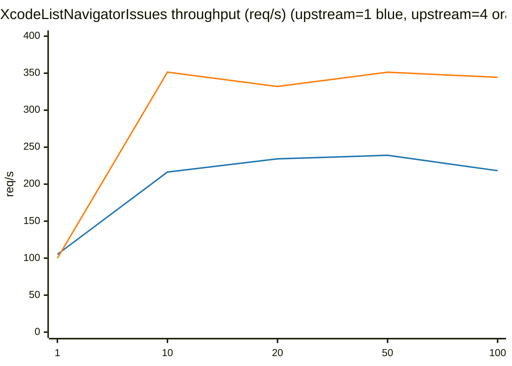
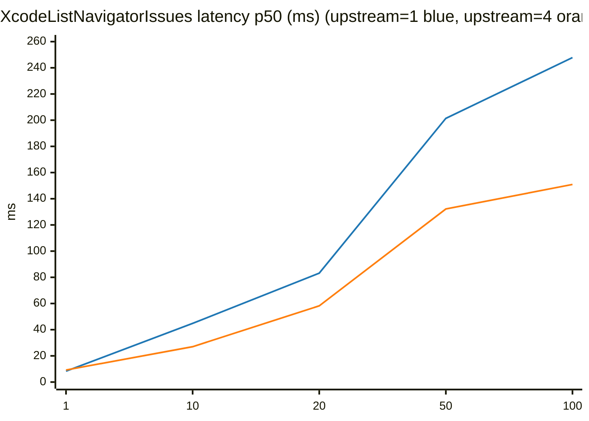
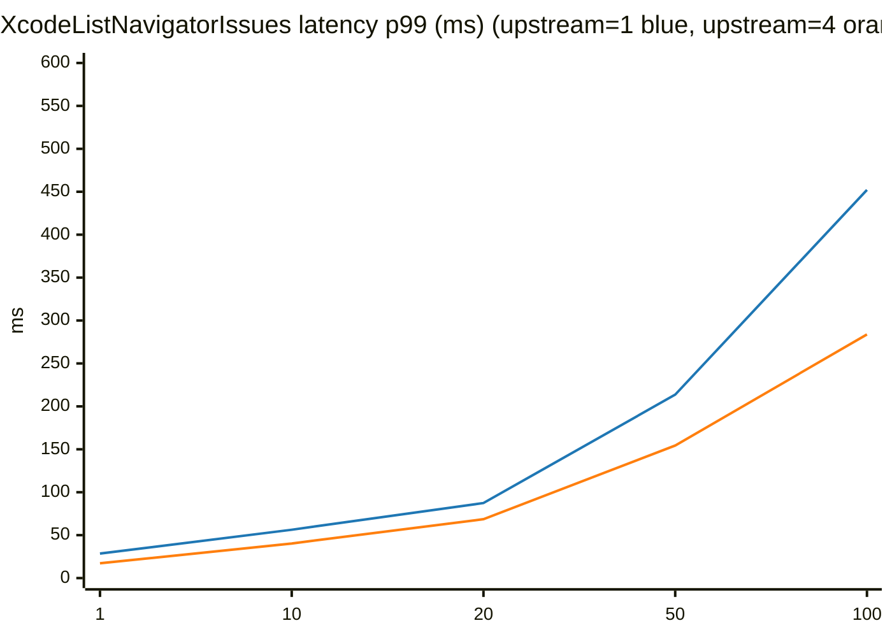
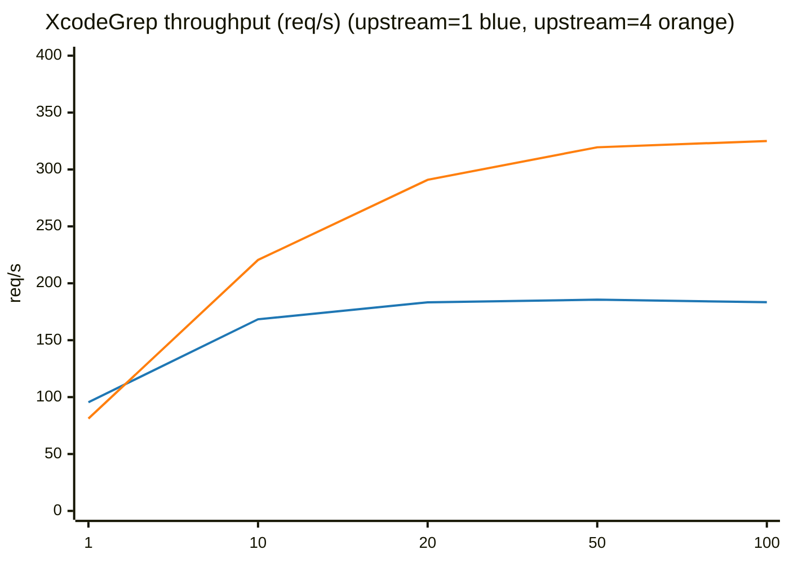
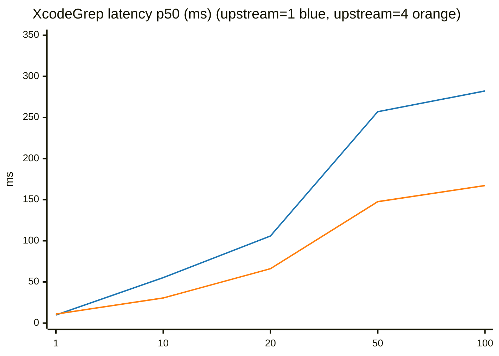
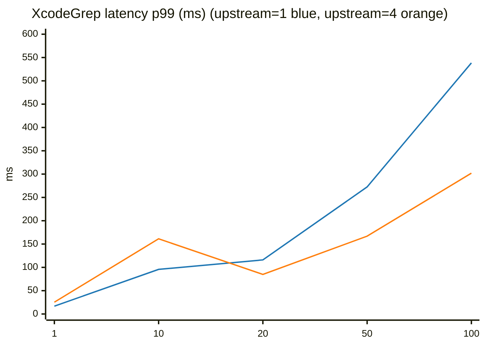
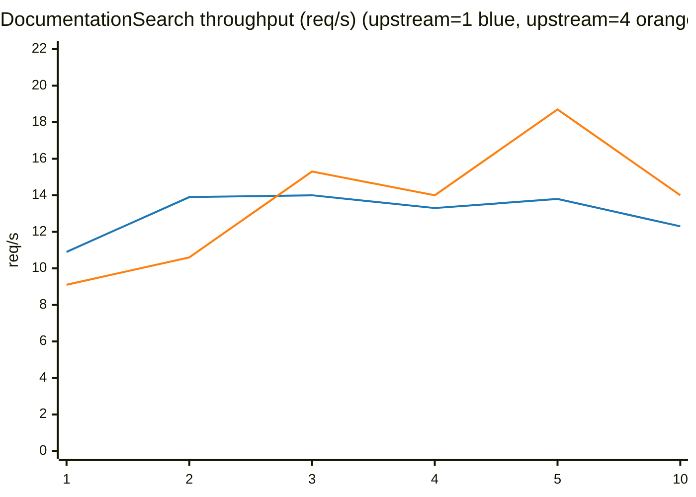
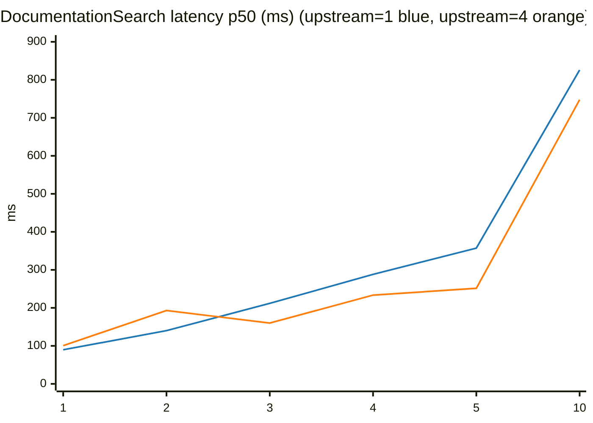
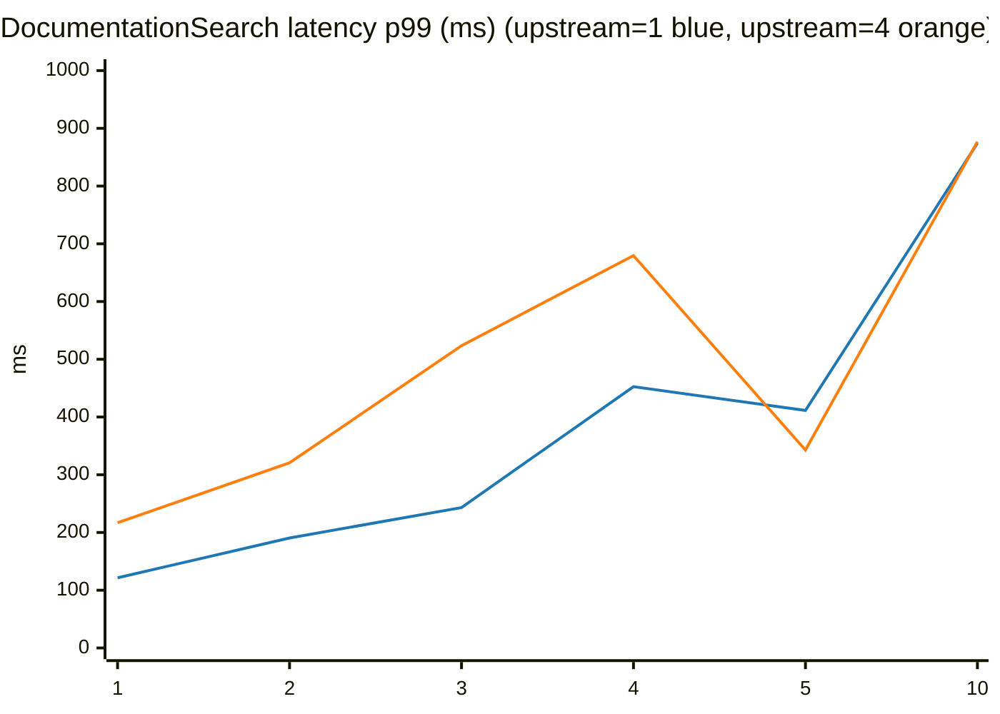

# MCP / Xcode MCP Benchmark Notes (Upstream Processes: 1 vs 4)

This document benchmarks `xcode-mcp-proxy-server` with:
- `--upstream-processes 1` (no multiplexing)
- `--upstream-processes 4` (multiplexed upstream `mcpbridge` processes)

## TL;DR (This Run)
- `XcodeListNavigatorIssues`: throughput improved at `concurrency=10..100` (about 1.4x to 1.6x); slightly slower at `concurrency=1`.
- `XcodeGrep`: throughput improved at `concurrency=10..100` (about 1.3x to 1.8x); slower at `concurrency=1`.
- `DocumentationSearch`: mixed. Throughput got worse at low concurrency (`1..2`) but improved at `>=3`; tail latency can spike, so keep parallelism low.

Important: results vary significantly depending on Xcode state (indexing/build activity, issue count, etc.). Treat these as snapshots and re-run under production-like conditions.

## Environment
- Date:
  - upstream=4: `2026-02-06T19:49:11+09:00`
  - upstream=1: `2026-02-06T19:29:37+09:00`
- macOS: `26.2 (25C56)`
- Xcode: `26.3 (17C519)`
- CPU: `Apple M1 Pro` (`hw.ncpu=10`)
- RAM: `32 GiB` (`hw.memsize=34359738368`)

## Servers Used
Both servers were started with an auto-selected port (`--listen localhost:0`).
Note: the current default listen is `localhost:8765`; pass `--listen localhost:0` to reproduce this setup.

- upstream=4:
  - endpoint: `http://localhost:65341/mcp`
  - raw logs: `/tmp/mcp_bench_upstream4_rerun_20260206_194911`
- upstream=1:
  - endpoint: `http://localhost:63766/mcp`
  - raw logs: `/tmp/mcp_bench_upstream1_rerun_20260206_192937`

`tabIdentifier` used in this run: `windowtab4` (`/Users/kn/Dev/XcodeMCPKit`)

## Method
- Benchmark tool: `Tools/mcp_bench.swift`
- 1 request = 1 MCP JSON-RPC call (`tools/call`)
- `--concurrency` = number of in-flight HTTP `POST /mcp` requests
- `--warmup` requests are not measured
- `--timeout` is the client-side per-request timeout (timeouts are counted as `err`)
- `initialize` is performed before each benchmark run (session setup)

Per tool settings:
- `XcodeListNavigatorIssues` / `XcodeGrep`: `requests=100`, `warmup=10`, `timeout=30s`
- `DocumentationSearch`: `timeout=60s` (warmup is `mcp_bench` default `20`; request counts vary by row)

Notes:
- If the Xcode permission dialog has not been approved, `initialize` / `tools/call` may time out. Approving once before benchmarking makes results more stable.
- For easier replication and `mcp_bench`'s default URL, consider using a fixed port: `--listen localhost:8765`.

## Inputs Used

### XcodeListNavigatorIssues
```json
{
  "tabIdentifier": "windowtab4",
  "severity": "warning"
}
```

### XcodeGrep
```json
{
  "tabIdentifier": "windowtab4",
  "pattern": "mcpbridge",
  "type": "swift",
  "outputMode": "count",
  "headLimit": 50
}
```

### DocumentationSearch
```json
{
  "query": "URLSession data task"
}
```

## Results
Legend:
- throughput = `requests / wall` (req/s). Higher is better.
- latency is reported by `mcp_bench` (ms). Lower is better.
- speedup = `throughput(upstream=4) / throughput(upstream=1)`. Higher is better.

Graph colors (fixed via Mermaid `plotColorPalette` in every chart):
- upstream=1: blue (`#1f77b4`)
- upstream=4: orange (`#ff7f0e`)

### XcodeListNavigatorIssues
#### Table (Throughput)
| concurrency | thr (1) | thr (4) | speedup |
|---:|---:|---:|---:|
| 1 | 105.1 | 99.9 | 0.95x |
| 10 | 216.4 | 351.4 | 1.62x |
| 20 | 234.2 | 332.0 | 1.42x |
| 50 | 239.0 | 351.3 | 1.47x |
| 100 | 218.2 | 344.4 | 1.58x |

#### Table (Latency)
| concurrency | p50 (1) | p50 (4) | p99 (1) | p99 (4) |
|---:|---:|---:|---:|---:|
| 1 | 8.3 | 9.2 | 28.6 | 17.2 |
| 10 | 44.8 | 27.0 | 56.3 | 40.3 |
| 20 | 83.2 | 58.2 | 87.4 | 68.6 |
| 50 | 201.4 | 132.2 | 213.7 | 154.4 |
| 100 | 247.8 | 150.9 | 452.1 | 283.8 |

#### Graphs (Mermaid)






### XcodeGrep
#### Table (Throughput)
| concurrency | thr (1) | thr (4) | speedup | note |
|---:|---:|---:|---:|---|
| 1 | 95.5 | 81.1 | 0.85x | |
| 10 | 168.4 | 220.5 | 1.31x | |
| 20 | 183.3 | 290.9 | 1.59x | |
| 50 | 185.6 | 319.5 | 1.72x | |
| 100 | 183.4 | 325.0 | 1.77x | |

#### Table (Latency)
| concurrency | p50 (1) | p50 (4) | p99 (1) | p99 (4) |
|---:|---:|---:|---:|---:|
| 1 | 9.8 | 10.9 | 16.8 | 25.3 |
| 10 | 55.2 | 30.5 | 95.7 | 161.3 |
| 20 | 105.9 | 66.1 | 116.0 | 84.9 |
| 50 | 257.0 | 147.6 | 272.5 | 166.9 |
| 100 | 282.2 | 167.2 | 538.4 | 302.0 |

#### Graphs (Mermaid)






### DocumentationSearch
The `concurrency=5` rows are often timeout-prone and can dominate wall time. They are included in the tables, but the line charts below use the **no-error** `concurrency=5 requests=50` row.

#### Table (Throughput)
| concurrency | requests | err (1) | err (4) | thr (1) | thr (4) | speedup | note |
|---:|---:|---:|---:|---:|---:|---:|---|
| 1 | 20 | 0 | 0 | 10.9 | 9.1 | 0.83x | |
| 2 | 20 | 0 | 0 | 13.9 | 10.6 | 0.76x | |
| 3 | 30 | 0 | 0 | 14.0 | 15.3 | 1.09x | |
| 4 | 40 | 0 | 0 | 13.3 | 14.0 | 1.05x | |
| 5 | 30 | 1 | 0 | 0.5 | 18.4 | 36.80x | timeouts mixed in (upstream=1) |
| 5 | 50 | 0 | 0 | 13.8 | 18.7 | 1.36x | |
| 10 | 20 | 0 | 0 | 12.3 | 14.0 | 1.14x | |

#### Table (Latency)
| concurrency | requests | p50 (1) | p50 (4) | p99 (1) | p99 (4) | note |
|---:|---:|---:|---:|---:|---:|---|
| 1 | 20 | 89.7 | 100.7 | 121.5 | 216.8 | |
| 2 | 20 | 140.1 | 193.0 | 190.5 | 320.7 | |
| 3 | 30 | 211.8 | 160.0 | 243.2 | 523.5 | tail spike (upstream=4) |
| 4 | 40 | 288.1 | 233.5 | 452.6 | 679.5 | tail spike |
| 5 | 30 | 337.1 | 314.9 | 378.4 | 913.9 | timeouts mixed in (upstream=1) |
| 5 | 50 | 357.2 | 251.5 | 411.4 | 342.8 | |
| 10 | 20 | 825.9 | 747.6 | 874.1 | 876.7 | |

#### Graphs (Mermaid)
These charts use the stable `concurrency=5 requests=50` row (no errors in this run) and exclude the timeout-mixed row.






