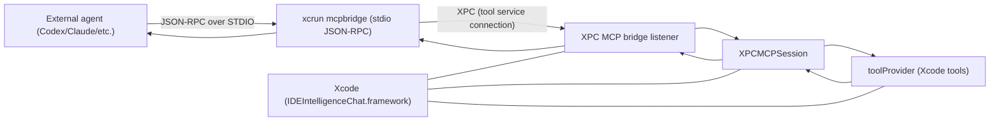
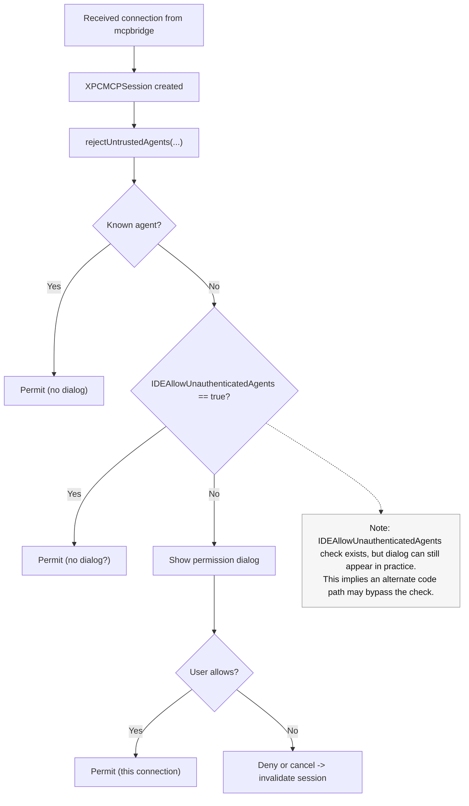
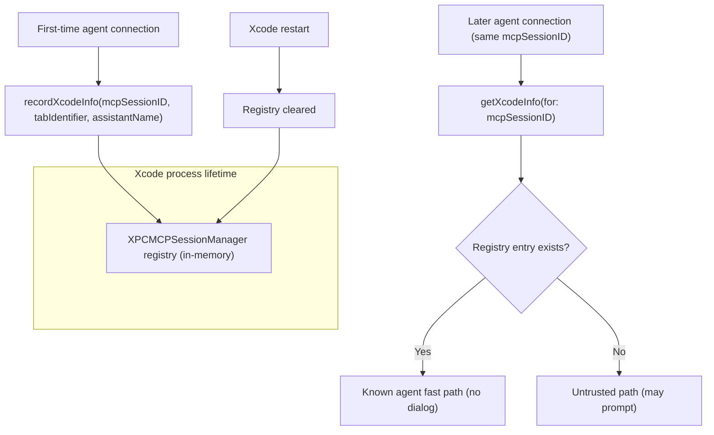

# MCP Connection Permission Dialog Investigation (Xcode 26.3)

## Summary
This note summarizes a static analysis of the MCP connection dialog in Xcode ("Allow “Codex” to access Xcode?"), focusing on `IDEIntelligenceChat.framework`.  
Conclusion: **no reliable path was found to skip the dialog using external parameters alone (environment variables / plist / normal settings).**

## Environment
- Xcode: 26.3 (Build 17C519)
- Targets:
  - `/Applications/Xcode.app/Contents/PlugIns/IDEIntelligenceChat.framework/Versions/A/IDEIntelligenceChat`
  - `/Applications/Xcode.app/Contents/PlugIns/IDEIntelligenceAgents.framework/Versions/A/IDEIntelligenceAgents`

## Diagrams

### High-Level Data Flow


### Permission Decision Path (Hypothesis)


### Known Agent Fast Path (Hypothesis)


## Key Observations (High Level)
- The dialog is triggered inside `XPCMCPSession.rejectUntrustedAgents(...)`.
- There is a **"known agent" fast path** that allows without showing the dialog.
  - Log string: `Permitting connection from known agent '%s'.`
  - String address: `0x8eb020` (xref: `0x320c68`)
- `IDEAllowUnauthenticatedAgents` is read via `NSUserDefaults.standard boolForKey:`.
  - If true, it returns early (skips dialog), but
  - In practice the dialog still appears, so **there is a route that bypasses this check**.
- `IDEChatAllowAgents` / `IDEChatAgenticChatSkipPermissions` /
  `IDEChatInternalAllowUntrustedAgentsWithoutUserInteraction` are **only read via AppStorage (UI settings)**.
  - They do **not** appear to suppress the connection dialog directly.
- `IDEChatSkipPermissionsForTools` / `IDEChatSkipPermissionsForTrustedTools` are for **tool execution permissions**.
  - Separate from connection dialog.
- `CodingAssistantAllowExternalIntegrations` is read by `UserDefaultsDeviceManagementSettings`,
  - No direct relation to `rejectUntrustedAgents` was found.
- `XcodeCodingAssistantSettings.blob` is JSON but empty (`[]`), and no connection permission persistence was observed.
- `toolPermissions.json` is for tool execution (`dangerouslyAllowAllShellCommands`), not connection permission.

## Dialog-Related Log Strings (xref)
- `An Xcode setting prevented an untrusted agent from connecting` (`0x8eafa0`)
- `User permitted an untrusted agent for this connection: %s` (`0x8eafe0`)
- `Permitting connection from known agent '%s'.` (`0x8eb020`)
- `Invalidating XPCMCPSession due to lack of user permission: %s` (`0x8eaf60`)
- `User denied or cancelled the agent connection` (`0x8eb070`)
- `***** Session ID: %s` (`0x8eb050`)

## MCP Bridge Lifecycle (xref)
These strings strongly suggest the MCP server-side bridge runs inside `IDEIntelligenceChat.framework`,
creates an XPC listener, and accepts connections from `mcpbridge`.

- `Initializing XPC MCP bridge` (`0x8eb7f0`)
- `Starting XPC MCP bridge listener` (`0x8eb830`)
- `Received connection from mcpbridge, creating session` (`0x8eb860`)
- `Tool provider not initialized` (`0x8eb110`)
- `Tool provider initialized successfully` (`0x8eb510`)
- `Session initialized with context: %s` (`0x8eb670`)

## MCP Request Log Strings (xref)
- `listTools called` (`0x8eae90`)
- `Received listTools request` (`0x8eb4a0`)
- `Calling toolProvider.listTools()` (`0x8eb440`)
- `Sent listTools response` (`0x8eb420`)
- `Received callTool request for '%s'` (`0x8eb470`)
- `Sent output to bridge` (`0x8eb130`)
- `Sent progress update: %ld/%s` (`0x8eb0f0`)

## Known-Agent Determination (Hypothesis)
`XPCMCPSessionManager` contains an in-memory registry:
- `recordXcodeInfo(mcpSessionID, tabIdentifier, assistantName)` (`0x323434`)
- `getXcodeInfo(for: UUID)` (`0x3234f8`)

This suggests **"known agent" is based on registry match by `mcpSessionID`**.  
The registry is **process memory only**, so it is not persisted across Xcode restarts.

## External Parameters Tried (No Effect)
Even with these defaults set, the dialog continued to appear:
- `IDEAllowUnauthenticatedAgents = 1`
- `IDEChatAllowAgents = 1`
- `IDEChatAgenticChatSkipPermissions = 1`
- `IDEChatInternalAllowUntrustedAgentsWithoutUserInteraction = 1`
- `IDEChatSkipPermissionsForTools = (...)`
- `IDEChatSkipPermissionsForTrustedTools = (...)`
- `CodingAssistantAllowExternalIntegrations = 1`

## Patch (Works, Not Recommended)
A binary patch that forces the allow branch in `rejectUntrustedAgents` worked.
Example: patch around `0x32183c` to set `mov w19, #1` and branch to `0x321b50`.

## Summary
- **No complete skip via external parameters was found.**
- Realistic bypass options:
  - **Ride the "known agent" path** (session reuse), or
  - **Binary patch**.
- The "known agent" path likely requires **reusing the same `mcpSessionID` without restarting Xcode**.

## Reference Commands
```bash
# String search
strings -a -t x IDEIntelligenceChat | rg -n "untrusted|Permitting|Session ID"

# Disassembly
xcrun llvm-objdump -d --print-imm-hex IDEIntelligenceChat | rg -n "0x8eafa0|0x8eafe0"

# UserDefaults check
defaults read com.apple.dt.Xcode | rg -n "IDEChat|Agent|Unauthenticated|CodingAssistant"
```
